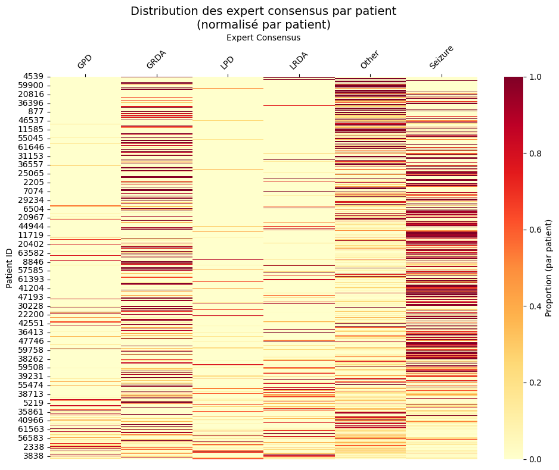
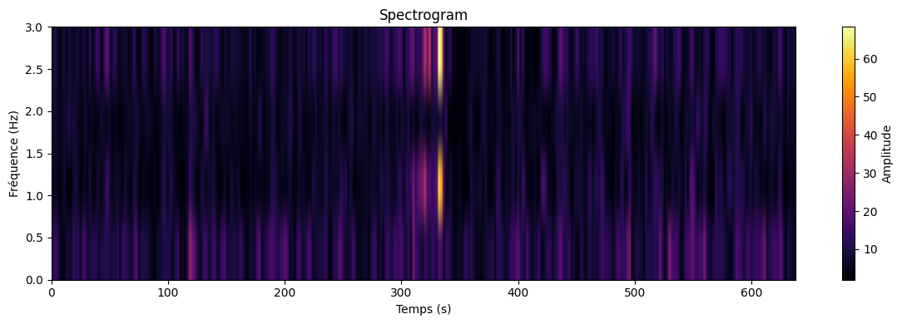
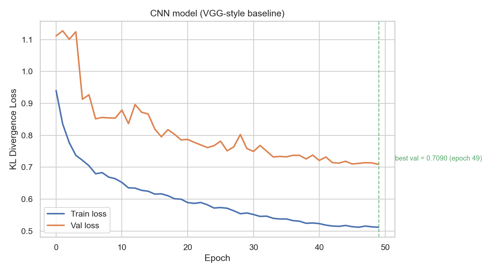
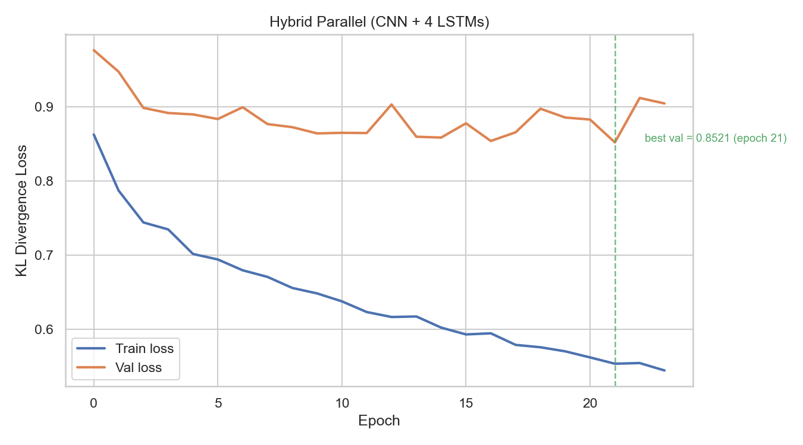
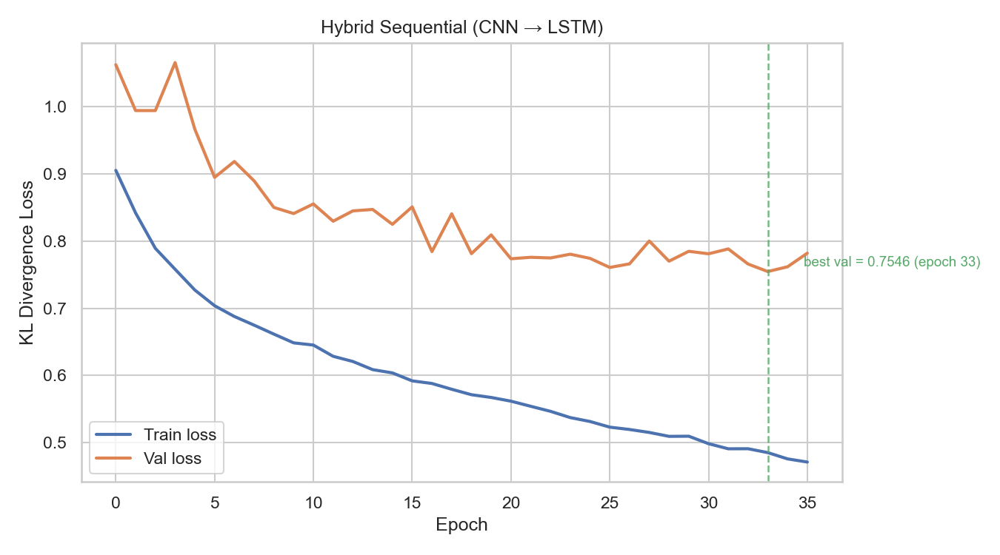
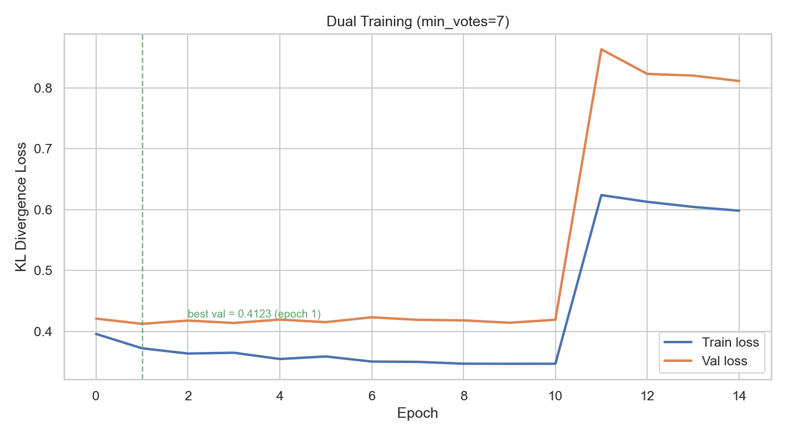
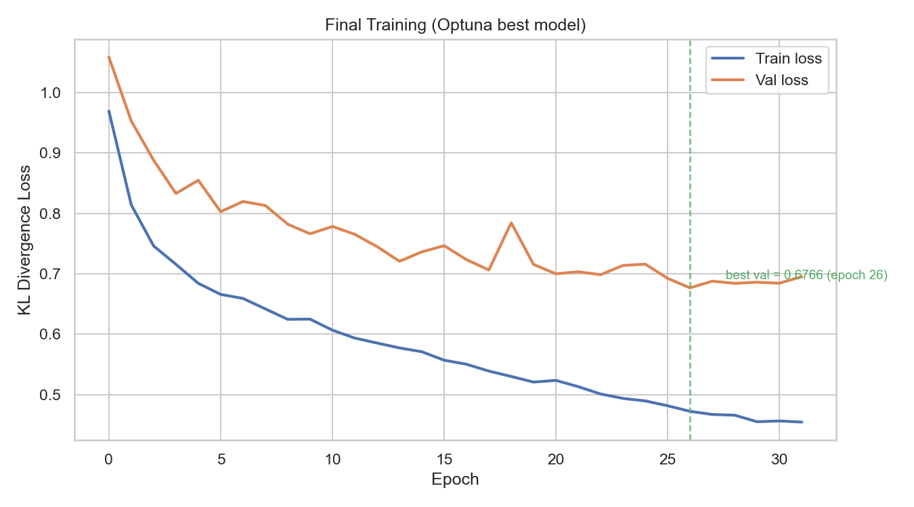
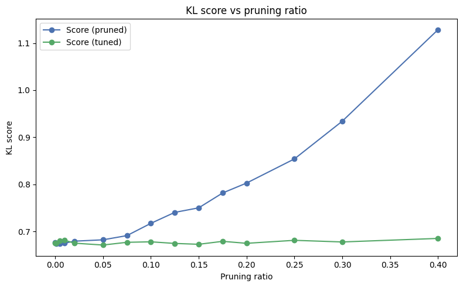
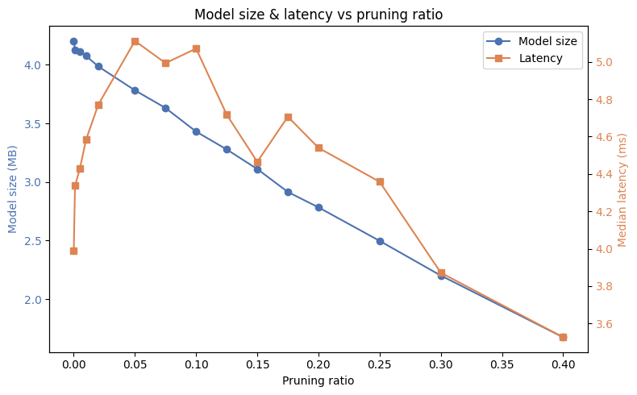
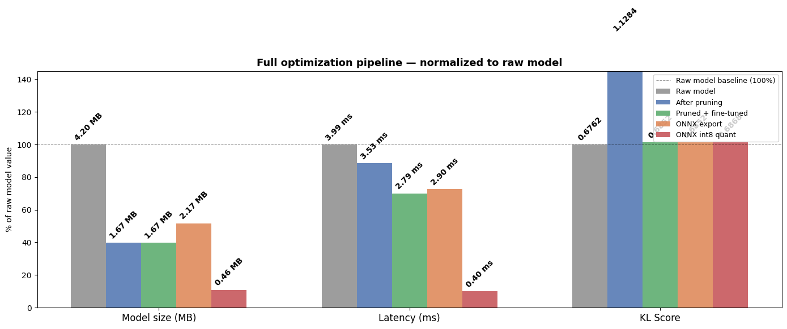

# Project Summary — EEG Brain Activity Classification

---

## Context & Positioning

This project is a simulated applied data science engagement in a medical context. The premise: a hospital neurology department is facing a data handling bottleneck — continuous EEG recordings from ICU patients generate far more data than clinicians can process in real time. The hospital wants to explore whether a machine learning model could assist clinicians in surfacing brain activity patterns worth prioritising. The constraint is practical: *any deployed solution must run on existing hospital hardware* (bedside tablets, ARM CPUs) without cloud dependency, without a GPU, and without a Python runtime.

This scenario reflects a broader principle: applied data science projects live outside notebooks. They must begin at the user level — understanding the need, the environment, the constraints — and circle back to the user with a solution that works in real-life settings.

This project uses the dataset from the Kaggle HMS — Harmful Brain Activity Classification competition, which provides a realistic proxy for this use case. It is framed as a full-stack applied data science exercise rather than a leaderboard competition: the objective is to frame the problem from a user need, make modelling decisions grounded in that framing, and deliver a production-ready artifact with documented trade-offs.

---

## Executive Summary

**Task.** Build a diagnostic aid that classifies six harmful brain activity patterns — Seizure, LPD, GPD, LRDA, GRDA, Other — from EEG spectrograms, and deliver it as a lightweight model ready for immediate deployment on medical tablet hardware.

**Approach.** The project uses the HMS Kaggle 2024 dataset (EEG spectrograms, soft expert-vote labels, 1,950 patients). The modelling stack is PyTorch / PyTorch Lightning, with a visual deep learning approach (2D CNN treating spectrograms as images) and a hybrid CNN+LSTM variant explored as an alternative. The compression pipeline — structured pruning, post-training quantisation, ONNX export — is a core deliverable, not an appendix: without it, the model cannot run on the target hardware.

**Key results.**

| Milestone | Val KL loss | Size | Latency |
|---|---|---|---|
| Baseline CNN | 0.709 | 1.55 MB | — |
| Best model (Optuna-tuned CNN) | **0.677** | 4.20 MB | ~4 ms |
| + Magnitude pruning (40%) + fine-tuning | 0.685 | 1.67 MB | ~3 ms |
| + ONNX int8 quantisation (final artifact) | **0.687** | **0.46 MB** | **0.40 ms** |

The Optuna model is larger than the hardcoded baseline (4.20 MB vs 1.55 MB) because the architecture search found a wider channel configuration (1.1M vs 406K parameters). The final ONNX int8 model is **~89% smaller** and **~10× faster** than the uncompressed Optuna model, with only +0.010 KL degradation — a viable trade-off for edge deployment.

---

## 1. Problem & Dataset

### 1.1 Task definition

The six target classes — Seizure, LPD (Lateralised Periodic Discharge), GPD (Generalised Periodic Discharge), LRDA (Lateralised Rhythmic Delta Activity), GRDA (Generalised Rhythmic Delta Activity), and Other — cover the main harmful brain activity patterns monitored in ICU settings.

Each sample is a 50-second EEG window annotated by multiple clinical experts. Rather than collapsing these annotations into a single hard label, the dataset provides the raw vote counts per class, which are normalised into a **probability distribution** used directly as the training target. This soft-label formulation has two practical advantages. First, it is more representative of real-world ambiguity: some EEG segments genuinely sit between categories, and training on a flat distribution over ambiguous cases is more informative than forcing an arbitrary hard label. Second, it means the model learns to output **calibrated probabilities**, not just a class index — the predicted distribution can be used to express confidence (a peaked distribution signals a clear-cut case; a flat one signals ambiguity), which is directly actionable for clinicians triaging a review queue.

Training uses **Kullback-Leibler divergence loss** (KL divergence), which measures how much the predicted probability distribution diverges from the target distribution. This is both the official competition metric and the natural loss for a distribution regression task.

A meaningful lower bound is the **dummy baseline KL ≈ 1.380** — the score obtained by always predicting the dataset-wide mean class distribution, regardless of input. Any model above this threshold has zero discriminative value.

### 1.2 Data

The dataset contains **106,800 annotated subsample rows** derived from **17,089 unique EEG recordings** across **1,950 patients** (11,138 unique spectrograms). Each EEG recording can have multiple overlapping annotation windows; the preprocessing pipeline retains only the highest-consensus subsample per recording, yielding **17,089 training samples** after deduplication.

Each raw spectrogram is a parquet file covering four EEG regions (Left Lateral — LL, Right Lateral — RL, Left Posterior — LP, Right Posterior — RP), with 100 log-frequency bins and a 2-second time resolution.

### 1.3 Class distribution

The dataset is significantly imbalanced: the *Other* category accounts for ~42% of samples after deduplication, while LRDA (the rarest pathology) represents only ~5.5%. This imbalance is not corrected by explicit resampling or class weighting — the model is trained on the natural distribution, which reflects the actual prevalence of these conditions in ICU populations.



---

## 2. Preprocessing Strategy

### 2.1 From raw parquets to model inputs

Each raw spectrogram covers up to 600 seconds at 2-second resolution (up to 300 time steps × 4 regions × 100 freq bins). The clinical annotation, however, refers to a **50-second review window** — the window actually inspected by the experts when producing their votes. Using the full 600-second recording as input would mean training the model on ~95% noise relative to the annotated signal.

The preprocessing pipeline standardises all inputs to this clinically meaningful window:

1. **Coarse crop** — extract a 600-second window starting 1 second after the annotation offset.
2. **Central 50-second window** — crop to the central 50 seconds of the coarse window, yielding exactly **25 time steps** (at 2 s/step).
3. **Reshape** — stack the four regional channels to produce an array of shape `(4, 100, 25)`.
4. **Save** — persist as a `.npy` file, keyed by `spectrogram_id–subsample_id`.

Edge cases where the crop produces fewer than 25 time steps (spectrograms near the boundary of the recording) are logged and skipped.

This cropping decision was the single largest performance lever in the project: switching from the full 300-step input to the 25-step central window reduced validation KL by approximately 0.10 — more than any architecture or regularisation change.



### 2.2 Normalisation

At training time, each spectrogram is normalised with a **two-step transform**:
- `log1p` compression to reduce the dynamic range of power values (EEG spectrograms have heavy-tailed amplitude distributions).
- **z-score normalisation** using per-fold training set mean and standard deviation, computed once via a streaming pass and cached to disk.

The cache (`data/cache/`) ensures that normalisation statistics are computed only on first run and reused consistently across all training sessions, preventing any risk of statistics leaking from validation data.

### 2.3 Annotation quality filtering

The dataset contains annotations with very different consensus levels, ranging from 1 to 28 expert votes per sample. A `min_votes` parameter controls how aggressively low-consensus samples are filtered before training. The default `min_votes=1` retains all 17,089 samples; `min_votes=7` retains only the 5,939 highest-consensus samples. Experiments with curriculum learning using this parameter are described in section 3.4.

### 2.4 Train/val split

Splits are produced by **StratifiedGroupKFold** (`n_splits=5`, `seed=273`) grouped by `patient_id`. This prevents patient leakage — a critical requirement since the same patient can contribute many EEG recordings — while preserving class balance across folds. A naive row-level random split would inflate validation performance and produce a model that fails to generalise to new patients.

The resulting split is well-balanced: class distributions across train and val sets are nearly identical (e.g., Other: 42.55% train vs 42.55% val; Seizure: 15.43% vs 15.42%), confirming that the stratification worked as intended.

---

## 3. Model Architecture Exploration

All models share the same input format `(batch, 4, 100, 25)` and output log-softmax probabilities over 6 classes. Training uses **AdamW** with a **cosine annealing** LR schedule. **Mixup augmentation** (Beta(α, α) mixing applied jointly to inputs and soft labels) was retained after empirical validation: it was one of the few augmentation strategies that produced a consistent improvement on the validation set (~0.035 KL gain over the baseline without it), and it is a natural fit for soft-label training since it mixes distributions rather than hard class assignments.

> **Other augmentation strategies tested and not retained:** SpecAugment-style frequency/time masking and additive Gaussian noise. Neither improved generalisation in ablation experiments.

### 3.1 Baseline CNN — VGG-style

The core idea is to treat each EEG spectrogram as a 2D image — frequency on one axis, time on the other, four regional channels stacked — and apply a standard image classification CNN. The baseline is a hardcoded VGG-style architecture: convolutional blocks with BatchNorm, ReLU, and MaxPool extract spatial patterns from the spectrogram, followed by global average pooling and a two-layer MLP head that outputs a distribution over 6 classes.

**Result:** Val KL = **0.709** (best epoch 49/50) — model size: **1.55 MB** (406K parameters)

This provided a strong, clean reference point. The model converged stably and served as the primary benchmark for all subsequent architectures.



### 3.2 Hybrid Parallel — CNN + 4 LSTMs

Motivated by the multi-channel structure of EEG, this architecture processes the spectrogram along two parallel paths:
- A **CNNHybrid** backbone processes the full 4-channel spectrogram and produces a global spatial embedding.
- **4 independent bidirectional LSTMs** each process a single channel along the time axis (reading the 25 time steps as a sequence of 100-frequency-bin vectors) and produce temporal embeddings.
- All embeddings are concatenated and fed to a two-layer MLP head.

**Result:** Val KL = **0.852** — *worse than the baseline*.



**Interpretation.** The parallel hybrid underperformed significantly. With only 25 time steps per channel, the LSTMs have insufficient temporal context to learn dynamics beyond what the CNN already captures spatially. The architecture also forces the LSTMs to process raw 100-dimensional frequency vectors as their input sequence, which is a high-dimensional, unstructured representation poorly suited to recurrent models. The increased optimisation complexity (4 independent LSTM branches + joint training) worsened gradient flow without adding discriminative capacity.

### 3.3 Hybrid Sequential — CNN → LSTM

To address the representation issue, this architecture first applies a CNN to extract per-timestep feature vectors — the 100 frequency bins are collapsed to a single pooled value per channel via adaptive average pooling, preserving all 25 time steps. The resulting sequence (25 time steps × 256 features) is then fed to a 2-layer bidirectional LSTM.

**Result:** Val KL = **0.755** — better than the parallel hybrid, but still worse than the pure CNN.



**Interpretation.** The sequential design is conceptually sounder — the CNN provides compressed, meaningful features before the LSTM reads the temporal sequence — but at 25 time steps, temporal modelling offers marginal benefit. EEG spectrograms at this resolution encode most of their discriminative information spatially (in frequency patterns), not temporally. The CNN alone captures this more efficiently. If raw EEG signals were used to compute higher-resolution spectrograms, recurrent architectures could become competitive — but this was out of scope for this project.

**Conclusion on hybrid approaches.** Both LSTM-based architectures failed to improve over the pure CNN baseline. The primary bottleneck is the temporal resolution of the pre-computed Kaggle spectrograms (2 s/step), which limits what a recurrent model can learn beyond what spatial convolutions already capture. Subsequent work focused entirely on optimising the CNN architecture.

### 3.4 Data strategy experiment — Dual-phase curriculum training

This experiment tested a **curriculum learning** approach: pre-train the Sequential model on all data (`min_votes=1`, 17,089 samples, 15 epochs), then fine-tune it exclusively on high-consensus annotations (`min_votes=7`, 5,939 samples, 40 epochs). The hypothesis was that a model first exposed to the full distribution of expert disagreement would build more robust representations before being sharpened on reliable annotations.

**Result:** Unstable — best val loss 0.41 at epoch 1 of the second phase, degrading to 0.81 by the end of training.



**Interpretation.** The apparent 0.41 KL at the start of phase 2 is misleading: the validation set is evaluated on the `min_votes=7` filtered subset, which has inherently higher-consensus annotations and lower KL. Once fine-tuning begins on this small, filtered subset (5,939 samples), the model quickly overfits, and validation performance on the full distribution degrades sharply. The combined effect of distribution shift and data volume reduction destabilised training. The result is documented as a negative finding — a deliberate dead-end that informs the decision to focus on architecture rather than data curriculum.

---

## 4. Hyperparameter Optimisation (Optuna)

Having established that the VGG-style CNN architecture was the strongest family, two Optuna studies were run to find the optimal configuration. Both used the **TPE sampler** with **MedianPruner** (early termination of unpromising trials based on intermediate validation scores).

### 4.1 Search space

**Study v1 (30 trials)** performed a broad search over learning rate, weight decay, dropout, mixup α, number of blocks {2, 3}, kernel size {1, 3, 5}, and per-layer channel widths. A constraint on total parameter count was enforced to avoid spending trials on architectures too large for the deployment target. Study v1 converged quickly — the dominant finding was that `kernel_size` accounts for ~68% of trial-to-trial variance in validation KL, with the maximum tested value (5) appearing in all top-performing trials. This suggested the search space was truncated and that larger kernels deserved exploration.

**Study v2 (up to 300 trials, many pruned early by MedianPruner)** narrowed the search to architecture and learning rate, fixing the regularisation parameters from v1. The key extension was adding `kernel_size=7` to the categorical space:

| Parameter | Type | Range |
|---|---|---|
| `learning_rate` | float (log-uniform) | [1e-4, 1e-2] |
| `kernel_size` | categorical | {5, 7} |
| `dim_0` … `dim_5` | int | [16, 256] each |

The architecture is fixed at **3 blocks** (each block = two ConvBlock + MaxPool + Dropout2d), with the 6 `dim` values controlling the channel widths across the 6 convolutional layers. Trials were pruned if `sum(hidden_dims) > 632` or total parameter count exceeded 2M, based on the best configurations from study v1.

Fixed from v1: `dropout=0.085`, `mixup_alpha=0.35`, `weight_decay=1.2e-5`.

### 4.2 Results

Best trial (trial 59, study v2): val KL = **0.676**

```
hidden_dims = [117, 52, 60, 64, 103, 226]
kernel_size = 5
lr          = 0.00283
```

The resulting channel progression is non-monotonic: the first layer starts wide (117), immediately contracts (52), then climbs gradually (60→64→103) before a strong final expansion (226). This departs from standard progressive-doubling heuristics and would not have emerged from manual search. Whether this specific configuration is principled or a local optimum found by TPE is hard to say — what matters is that it generalises, and the repeated finding that `kernel_size=5` outperforms smaller values is consistent across both studies.

### 4.3 Final training

The best Optuna configuration was retrained from scratch with full hyperparameters (up to 35 epochs, EarlyStopping patience=5, cosine LR `t_max=35`, with mixup). Training stopped at epoch 26 (best val KL = **0.677**).



---

## 5. Compression & Edge Deployment

The objective was to reduce model size and inference latency to the point where the model could run on a resource-constrained edge device — specifically, a medical tablet (ARM CPU, no GPU, intermittent or no network connectivity) — while preserving diagnostic utility. The compression pipeline was designed and benchmarked with this deployment context in mind, not as a post-hoc exercise.

### 5.1 Magnitude pruning

**Technique.** Structured magnitude pruning via `torch-pruning` (`MagnitudePruner`). Entire convolutional channels (filters) with the lowest L2 norm are removed across all backbone conv layers, yielding a genuinely smaller and faster model — unlike unstructured pruning, which zeroes out individual weights but leaves the parameter count and computational graph unchanged. The first input conv and the classifier head are excluded from pruning to preserve input compatibility and output quality.

**Protocol.** The pruning ratio was swept across 15 values from 0 to 0.4. At each ratio, the pruned model was fine-tuned for up to 15 epochs (early stopping, patience=5) at one-tenth of the original learning rate, and the best validation checkpoint was selected for evaluation.





**Results.**

| Pruning ratio | Size (MB) | Val KL (before fine-tuning) | Val KL (after fine-tuning) |
|---|---|---|---|
| 0% (original) | 4.20 | 0.676 | 0.675 |
| 10% | 3.43 | 0.717 | 0.678 |
| 25% | 2.50 | 0.854 | 0.681 |
| **40%** | **1.67** | **1.128** | **0.685** |

Fine-tuning is essential beyond ~10% pruning. Without it, 40% pruning raises KL to 1.13 — essentially random. After fine-tuning, it recovers to 0.685, within +0.008 of the original. This confirms that VGG-style CNNs carry substantial redundancy and that structured pruning followed by fine-tuning is the correct protocol. The 40% ratio was selected as the deployment candidate: it achieves a 60% size reduction for a negligible accuracy cost.

### 5.2 Post-training static quantisation

After selecting the 40%-pruned + fine-tuned model as the deployment candidate, static int8 quantisation was applied.

**Protocol.** Conv-BN-ReLU blocks were fused before quantisation (`qnnpack` backend, optimised for ARM/mobile). The validation dataloader was used as the calibration set to compute per-layer activation statistics (scale/zero-point). `log_softmax` was kept outside the quantised graph via a `QuantWrapperCustom` module, since `quantized::log_softmax` is not natively supported on CPU.

**PyTorch quantisation results** (from `data/quantize_results.csv`):

| Model | Size (MB) | Latency (ms) | Val KL |
|---|---|---|---|
| 40%-pruned float32 | 1.69 | 3.45 | 0.685 |
| 40%-pruned int8 | 0.43 | 1.81 | 0.686 |

Size reduction: **4× (75%)** with negligible accuracy loss. However, PyTorch native int8 quantisation is not compatible with ONNX export. Quantisation was therefore deferred to after ONNX export, using the ONNX Runtime quantisation API instead.

### 5.3 ONNX export

The pruned model was exported to ONNX format with `torch.onnx.export` (opset 17, dynamic batch axis), then quantised to int8 using `quantize_static` from `onnxruntime.quantization`, calibrated on the first 10 validation batches. ONNX Runtime achieves significantly better latency than PyTorch's native int8 backend, due to its optimised operator kernels and graph-level inference optimisations.

**ONNX pipeline results** (from `data/export_results.csv`):

| Stage | Size (MB) | Latency (ms) | Val KL |
|---|---|---|---|
| Pruned PyTorch float32 | 1.67 | 3.07 | 0.685 |
| ONNX float32 | 2.17 | 2.90 | 0.685 |
| **ONNX int8 (final)** | **0.46** | **0.40** | **0.687** |

The ONNX int8 model achieves **0.40 ms inference** on CPU — an order-of-magnitude improvement over the original PyTorch model. The slight size increase from PyTorch float32 to ONNX float32 is due to protobuf format overhead.



### 5.4 End-to-end compression summary

Starting from the original trained model and ending at the final ONNX int8 artifact:

| | Original | Final ONNX int8 | Change |
|---|---|---|---|
| Size | 4.20 MB | 0.46 MB | **−89%** |
| Latency (CPU) | ~4 ms | 0.40 ms | **~10× faster** |
| Val KL loss | 0.677 | 0.687 | **+0.010** |

A +0.010 KL increase corresponds to a negligible shift in the output probability distribution — the model's clinical utility is preserved while its computational footprint is reduced by nearly an order of magnitude. At 0.46 MB and 0.40 ms on CPU, this model can run on any modern Android or iOS tablet with no GPU, no network dependency, and no Python runtime required.

---

## 6. Results & Interpretation

For reference, a dummy predictor (always predicting the dataset mean distribution) achieves KL ≈ **1.380**. All trained models beat this by a wide margin; the final ONNX int8 artifact reaches **0.687** — half the KL of the naive baseline, representing a substantial improvement in the model's ability to allocate probability mass across pathology classes in a clinically meaningful way.

The project produced four clear findings:

1. **Preprocessing quality dominates early gains.** The single most impactful decision was cropping the spectrogram to the clinically annotated 50-second window — a ~0.10 KL improvement that no architecture change came close to matching. Understanding the data generation process before touching the model is not optional.

2. **CNN outperforms CNN+LSTM on short EEG spectrogram sequences.** At 25 time steps, temporal structure carries less discriminative information than frequency patterns. Both hybrid architectures underperformed the pure CNN baseline, a result that is principled rather than incidental: the 2-second time resolution of the pre-computed spectrograms discards the sub-second dynamics that recurrent models need to contribute meaningfully.

3. **Architecture search finds non-obvious configurations that manual design misses.** The best Optuna configuration (non-monotonic channel progression, large final-stage width) would not have emerged from standard design heuristics. The HPO study also revealed that kernel size is the dominant hyperparameter — a finding that reshaped the search space for the second study.

4. **Aggressive pruning (40%) is fully recoverable with fine-tuning, and ONNX int8 is the right endpoint for edge deployment.** PyTorch native int8 offers size savings but limited latency improvement. ONNX Runtime int8 achieves a 10× latency reduction with only +0.010 KL degradation — making it the unambiguous choice for any real deployment scenario where inference speed and footprint matter.

**Clinical deployment perspective.** The final artifact — 0.46 MB, 0.40 ms, language-agnostic ONNX format — is ready for integration into a bedside monitoring application on standard medical tablet hardware. It requires only `onnxruntime` and `numpy`, runs entirely on-device, and produces calibrated probability distributions over six pathology classes that can be used to prioritise neurologist review queues. The gap to state-of-the-art (Kaggle top-1 KL ≈ 0.27) is attributable to the use of pre-computed spectrograms rather than raw EEG with wavelet transforms — a representational constraint that was documented and accepted as a scope boundary, not discovered post-hoc.

---

## Tech Stack

| Library | Version | Role |
|---|---|---|
| Python | ≥ 3.12 | — |
| PyTorch | 2.11 | Model definition, training, pruning, quantisation |
| PyTorch Lightning | 2.6 | Training loop, callbacks (ModelCheckpoint, EarlyStopping, LRMonitor) |
| torch-pruning | 1.6 | Structured magnitude pruning (`MagnitudePruner`) |
| ONNX | 1.21 | Model serialisation |
| ONNX Runtime | 1.24 | Optimised CPU inference, static int8 quantisation |
| Optuna | 4.8 | Bayesian hyperparameter search (TPE sampler + MedianPruner) |
| scikit-learn | 1.8 | `StratifiedGroupKFold` for patient-aware cross-validation |
| pandas / numpy / pyarrow | — | Data loading, preprocessing, metadata management |
| matplotlib / seaborn | — | Result visualisation |
| uv | — | Dependency management |

**Development environment:** MacBook M4 Pro, MPS backend, bf16 mixed-precision training. Notebooks are structured to run sequentially (1 → 11) and load from the shared `src/` modules.
